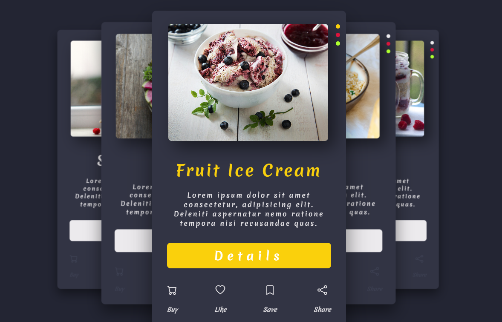

# 🎠 Carousel Slider

---

## Intro

Halo teman-teman! 👋  
Selamat datang di repository sederhana ini yang berisi **Carousel Slider** dengan tampilan yang manis dan elegan.  
Slider ini dibuat hanya menggunakan **HTML** dan **CSS**, tanpa tambahan library atau JavaScript.  
Cocok banget untuk belajar dasar-dasar carousel dan mempercantik tampilan website kamu!

---

## ✨ Fitur Menarik

- 🎠 Carousel slider sederhana & smooth.
- 🎨 Desain kartu yang estetik.
- 🌙 Tema dark mode yang modern dan elegan.
- 💡 Fully dibuat hanya dengan HTML & CSS (tanpa JS).
- 📱 Cocok untuk belajar UI/UX interaktif dasar.

---

## 🛠 Teknologi yang Dipakai

- HTML5.
- CSS3 (Flexbox & Animasi).

---

## 🚀 Cara Pakai

1. Clone atau download repo ini.
2. Buka file `index.html` langsung di browser kamu.
3. Kustomisasi gambar, teks, atau gaya sesuai kreativitasmu!

